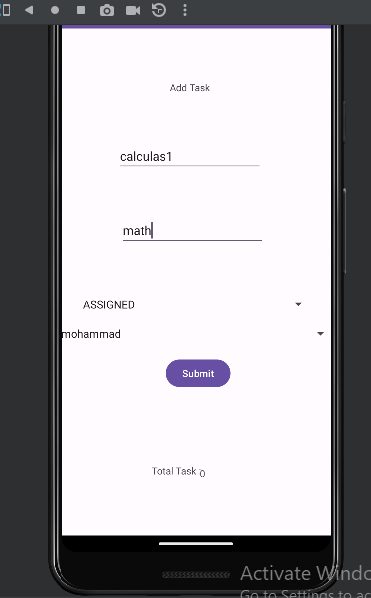
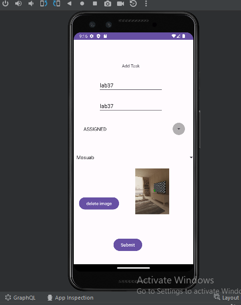

# taskmaster

## lab26

For today's lab ,I started to build an Android app that will be a main focus of the second half of the course: 
TaskMaster. While I started small today, over time this will grow to be a fully-featured application.

I just create a 3 pages home page i have two buttons:
1-move me to add task page that I can add task and submitt the task
2- all tasks that is empty until now just I have image

## lab27

For today's lab , I updated the home page and added Settings and Task Detail Page ,the user name in home page will be the same user name that user enter in setting page.

Settings Page:

I Created a Settings page.allow users to enter their username and hit save.

Homepage:
I Created The main page different buttons with hardcoded task titles. When a user taps one of the titles,go to the Task Detail page, and the title at the top of the page should match the task title that was tapped on the previous page.

also I Created a Task Detail page used Lorem Ipsum description.

## lab28

For today's lab ..
I updated the home page to use a RecyclerView for displaying Task data. This has hardcoded Task data for now.
I created a Task class. A Task should have a title, a body, and a state. The state should be one of “new”, “assigned”, “in progress”, or “complete”.
when user click on anyone of tasks move him to details about this task 

## lab29

For today's lab ..
I updated the add Task page to add task to room database .
I Updated a main page and detail when i click in one of tasks move me to detail of the class i added, to represent tabel in databse
I fetched the data from the database to the home's RecyclerView

## Lab31
For today's lab ..

Ensured espreeso tests are functional.

Refactored Main Activity and all code

## Lab31
For today's lab ..

Updated all references to the Task data to instead use AWS Amplify to access data in DynamoDB instead of in Room.
Modified Add Task to save the data entered in as a Task to DynamoDB.
get all tasks from DynamoDB to render it in Main Activity
Ensured espreeso tests are work fine.

## Lab33
For today's lab ..

I Updated tasks to be owned by teams by Created a second entity for a team by adding a relation.

I created 3 Teams (Mosuab,ahmad,mohammad).

I created a spinner in add task page to selected a team when task added.

in Settings Page,allow the user to choose their team on the Settings page,
filter tasks  to display only that team’s tasks on the homepage.

Finally,I added a new test to ensure that every thing is working good related to new entity I added and spinner to selected the team, i ensured that every thing is Ok.

## Lab34
For today's lab ..
I was able to add updates(description ,title,team,state ) of the task,and able to  deletes the tasks.

I will put my screen shots and explain the process:

1-firs image I created to tasks and called same name (new task)

2-second image I edit the title and all details for this task

3-third image you can see the change in the task after edit

4-fourth image I want to delete that one of new task I did not edit
5- last image  you can see the tasks after I delete new task (it's deleted)

## Lab36
For today's lab ..

1. Add Cognito to Amplify setup:

Integrate Cognito into the Amplify configuration.
2. Implement user login and signup flow:

Develop a user interface for logging in and signing up.
Connect the login and signup forms to Cognito authentication services.
3. Display username on homepage:

Upon successful user login, retrieve the username from Cognito.
Display the username prominently at the top of the homepage.
4. Enable user logout:

Implement a logout button or mechanism within the application.
Upon user logout, clear authentication tokens and redirect the user to a non-logged-in state.

##  Lab37
For today's lab ..
In today's lab I implemented AWS S3 that allowed user to store task images and display them.

## lab38
For today's lab ..
I Added an intent filter to my application that a user can hit the “share” button on an image in another application.

